# Stroke Risk Exploratory Data Analysis

**Author:** Emilio Molina Román  
**Date:** June 1, 2025

---

## Executive Summary

This report explores a healthcare dataset containing clinical and demographic information related to stroke prediction. Using exploratory data analysis (EDA), we analyze statistical distributions and identify key variables correlated with stroke occurrence. The findings highlight that age, hypertension, heart disease, glucose levels, and BMI strongly influence stroke risk. This EDA will serve as a foundation for future predictive modeling efforts.

---

## Dataset Overview

- Records: 5,110 patients
- Features: 11 clinical and demographic variables + target (`stroke`)
- Data Source: Kaggle - Stroke Prediction Dataset

**Main Features:**
- `age` (continuous)
- `avg_glucose_level` (continuous)
- `bmi` (continuous, some missing values)
- `hypertension` (binary)
- `heart_disease` (binary)
- `gender` (categorical)
- `ever_married` (categorical)
- `work_type` (categorical)
- `residence_type` (categorical)
- `smoking_status` (categorical: reconstructed from dummies)
- `stroke` (binary target)

---

## Methodology

- Data Cleaning & Preprocessing:
  - Handled missing BMI values.
  - Reconstructed categorical variables from encoded dummies.
  - Ensured correct data types.
- Univariate & Bivariate EDA:
  - Descriptive statistics.
  - Visual exploration via histograms, boxplots, and barplots.
- Exported visualizations for inclusion in the report.

---

## Exploratory Data Analysis

### Stroke Distribution

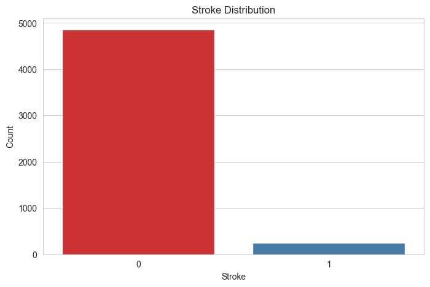

- Highly imbalanced: ~4.9% stroke cases.
- Critical consideration for future modeling (class imbalance techniques required).

---

### Age

#### Histogram

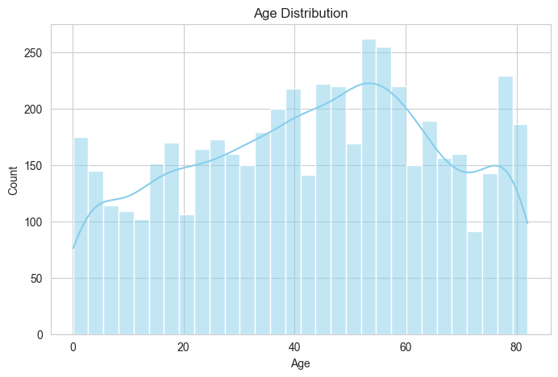

#### Boxplot

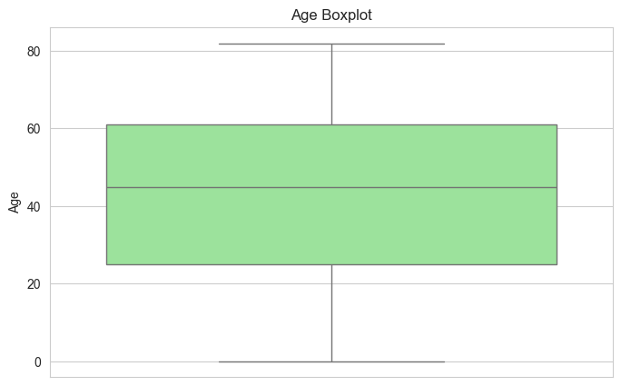

- Right-skewed age distribution.
- Median age for stroke patients significantly higher.
- Clear evidence that stroke risk rises steeply with age.

---

### Average Glucose Level

#### Histogram

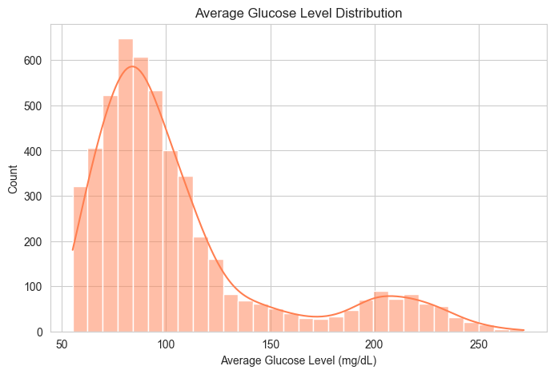

#### Boxplot

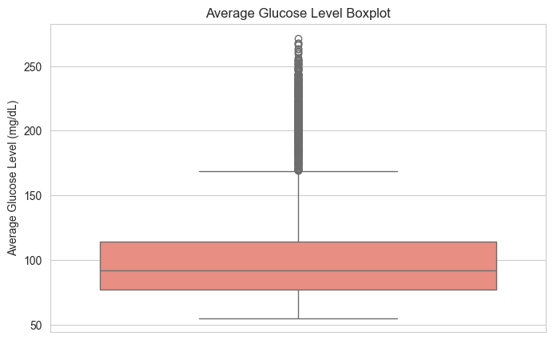

- Right-skewed glucose levels.
- Stroke patients have higher average glucose levels.
- Outliers exist at very high glucose values (indicative of diabetes risk).

---

### BMI

#### Histogram

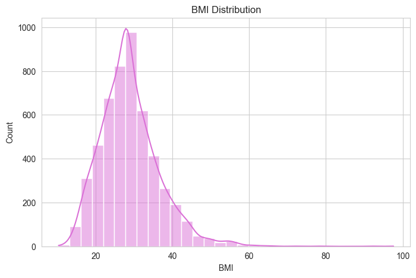

#### Boxplot

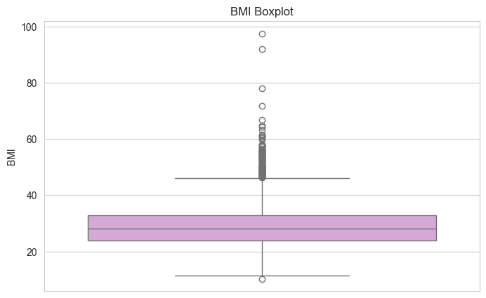

- BMI centered around 25-30 (overweight to mild obesity).
- Extreme obesity (BMI > 40) observed.
- Stroke patients tend to have slightly higher BMI.

---

### Hypertension and Heart Disease

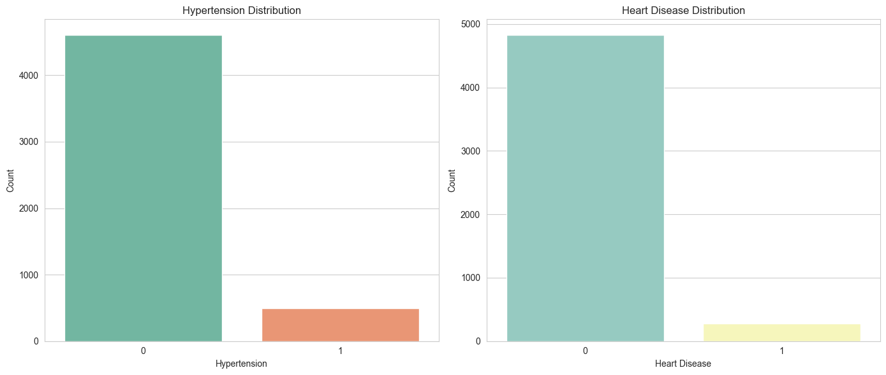

- Strong positive correlation with stroke.
- Hypertension present in a much higher proportion of stroke cases.

---

### Gender

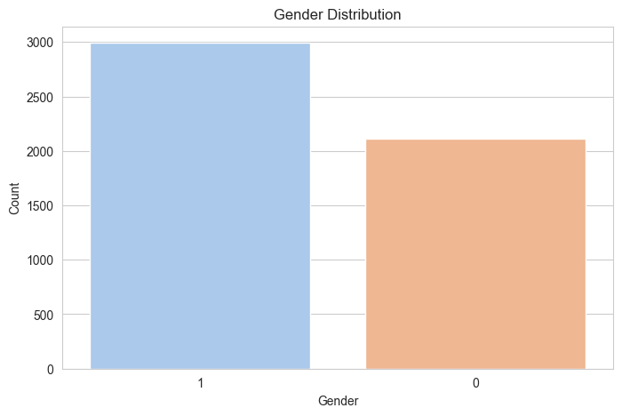

- Female majority (approx. 58% of dataset).
- No clear gender dominance in stroke occurrence after controlling for age.

---

### Smoking Status

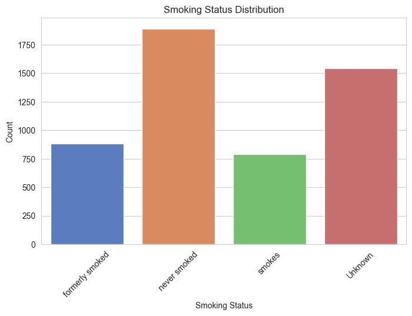

- Majority never smoked.
- Former smokers show slightly elevated stroke occurrence.
- Some complex interactions likely driven by confounding factors (age, comorbidities).

---

## Bivariate Analysis

### Age vs Stroke

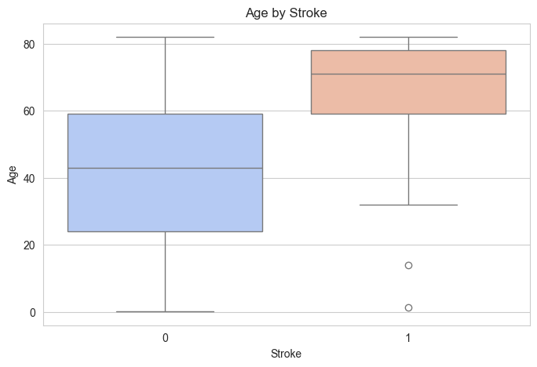

- Median age of stroke group substantially higher.
- Stroke becomes much more likely after 60 years.

---

### Glucose vs Stroke

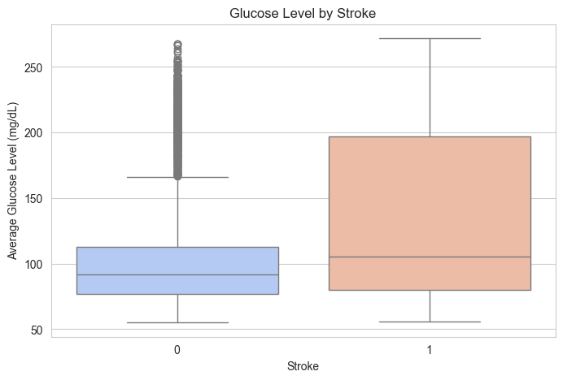

- Higher glucose levels in stroke cases.
- Hyperglycemia is a key stroke risk factor.

---

### BMI vs Stroke

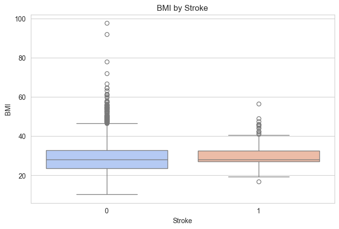

- Slight right-shift of BMI for stroke patients.
- Obesity plays a contributing role.

---

### Hypertension vs Stroke

- Stroke is much more prevalent in hypertensive patients.
- Hypertension may be one of the strongest single predictors.

---

## Statistical Hypothesis Testing

To validate the relationships observed in the exploratory analysis, formal statistical tests were performed:
- Categorical Variables:
Chi-Squared tests were applied to assess associations with stroke occurrence.
- Statistically significant associations were found for:
	•	Hypertension
	•	Heart Disease
	•	Ever Married
	•	Work Type
	•	Smoking Status
- No significant association was found for:
	•	Gender
	•	Residence Type
	•	Numerical Variables:
- Mann-Whitney U tests were applied to compare distributions between stroke and non-stroke groups.
	•	Significant differences (p < 0.05) were found for:
	•	Age
	•	Average Glucose Level
	•	BMI

These results confirm that multiple features are strongly associated with stroke risk and will contribute valuable information for future predictive modeling.
---

## Key Insights

- **Age** is the dominant risk factor.
- **Hypertension and Heart Disease** are highly correlated with stroke.
- **Glucose Level and BMI** show strong metabolic associations.
- **Class imbalance** is extreme: special techniques required for modeling.
- **Smoking** shows mixed results; likely confounded by age.

---

## Conclusion

The dataset reveals well-established clinical risk factors for stroke and demonstrates clear trends across multiple features. This EDA validates the dataset’s usefulness for predictive modeling and sets the stage for future machine learning applications in stroke prevention.

---